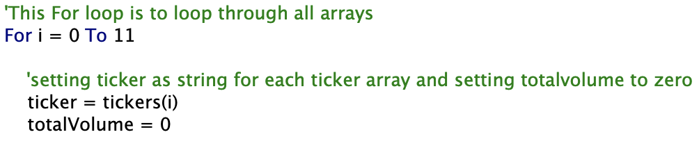
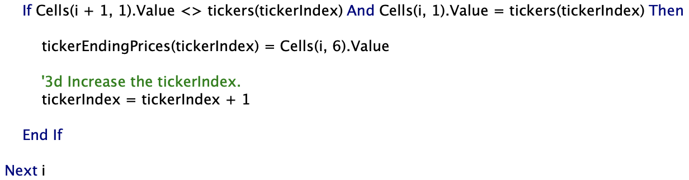
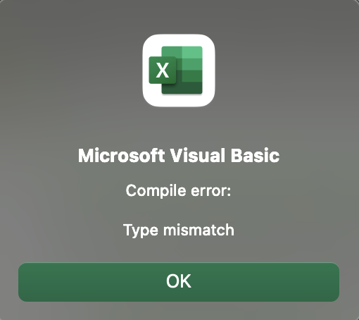
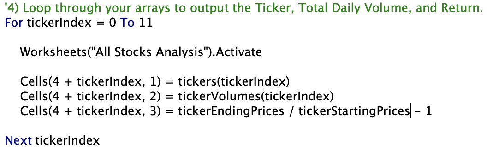
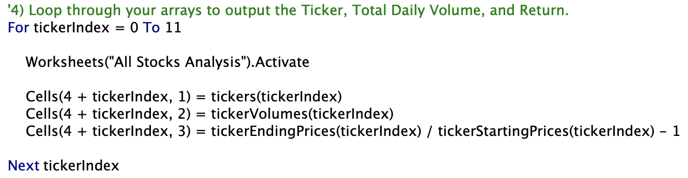

# Analysis of Different Company Stocks

## Overview of Project

In this project, we help Mr. Green find the best green energy stock for his parents to invest in. We use Excel VBA to create a macro to display the yearly return percentage of each stock listed in Mr. Green's Excel workbook for the years 2017 and 2018. We learn about `For` loops, `If-Then` conditionals, as well as how to conditionally format your data with VBA, and use buttons to run macros.

## Results

When looking at the results for 2017, we see that every green energy stock, except for TERP, had a positive yearly return. For the year 2018, every stock had a negative yearly return, except for ENPH and RUN. Looking at the 2018 results, it looks like ENPH and RUN are the two companies to invest in. If you look in further, you see that in 2017, ENPH and RUN had a yearly return of 129.5% and 5.5%, respectfully. In the year 2018, ENPH's yearly return declined to 81.9%, while RUN's yearly return increased to 84.0%. Using this information, it looks like RUN is the best green energy stock to invest in.

When looking at the execution times for the original and refactored scripts, the refactored code is significantly quicker than the original code.

## Summary

### What are the advantages or disadvantages of refactoring code?

One of the advantages of refactoring code is that you become more efficient at writing code. When you figure out how to run your code more smoothly, you continue to use that method for future scripts. 

One of the disadvantages of refactoring code is that you create a habit of building around your old code, instead of using it as a blueprint to refactor your code. In other words, instead of starting from scratch and using your original code as guidance, you use your original code and delete what doesn't work, and rewrite what does work.

### How do these pros and cons apply to refactoring the original VBA script?

One of the things I learned from this project was realizing that you don't need to write a nested `For` loop to iterate through each array. You make one `For` loop, and at the end of the loop you increase the iterator by one once your `If-Then` statement is satisfied and completed.

 

The con that I faced was trying to reuse parts of the original code by copying and pasting it to the refactored code and then changing the name of the variable. This part took the longest to debug because in the original code, `startingPrice` was a variable, and in the refactored code, `tickerStartingPrices` was an array, so I kept receiving a "compiling error: type mismatch" window because I forgot to add the parenthesis and the iterator to the array. So for the longest, I left it as `tickerStartingPrices` instead of `tickerStartingPrices(tickerIndex)`. I should not have copied and pasted the original code into the refactored code.

  
